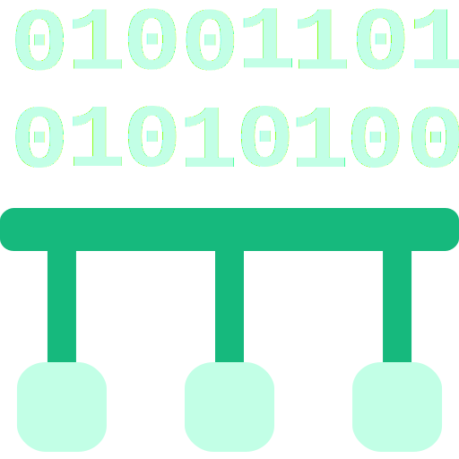

# Inowio Modbus Toolbox

Desktop toolkit for configuring, testing, and monitoring Modbus TCP/RTU devices. Built with Tauri, React, and TypeScript for a lightweight, cross-platform experience.



## Highlights

- Multi-protocol Modbus (TCP & RTU) with persistent workspace settings
- Device registry with register mapping, bulk import/export, and diagnostics
- Real-time analyzer powered by ECharts plus traffic capture for debugging
- Rich logging, dark/light theming, and keyboard-friendly UI
- Ships as a native desktop app for Windows, macOS, and Linux

## Getting Started

### Requirements

- Node.js 18+
- Rust (stable) + target-specific build tools (VS Build Tools on Windows, Xcode CLT on macOS, `build-essential` on Linux)

### Quick Start

```bash
git clone https://github.com/inowio-tech/inowio-modbus-toolbox.git
cd inowio-modbus-toolbox
npm install
npm run tauri dev
```

### Production Build

```bash
npm run tauri build
# Bundles land in src-tauri/target/release/bundle
```

## Development

```bash
npm run dev         # Vite frontend only
npm run tauri dev   # Full-stack dev (frontend + Rust)
npm run build       # Production frontend
npm run lint        # Frontend linting
npm run fmt         # Format Rust sources
```

Configuration tips:

- Dev server defaults: `VITE_DEV_SERVER_HOST=127.0.0.1`, `VITE_DEV_SERVER_PORT=1422`
- Bundled identifier: `TAURI_BUNDLE_IDENTIFIER=Inowio.ModbusToolbox`
- App data lives under the OS config directory (e.g., `%APPDATA%/Inowio/Modbus-Toolbox/` on Windows)

## Project Structure

```
inowio-modbus-toolbox/
├── src/            # React + TypeScript UI
├── src-tauri/      # Rust backend, Tauri config, icons
├── public/         # Static assets & screenshots
└── docs/           # Extended documentation & help content
```

## Troubleshooting

- **Connection issues** – confirm TCP reachability or serial permissions, then retry.
- **Slow polling** – lower polling frequency or close unused workspaces.
- **Build failures** – reinstall dependencies (`npm ci`), update Rust toolchain, and ensure platform build tools are present.
- **Debug logging** – run `RUST_LOG=debug npm run tauri dev` to surface backend traces.

## Contributing

Please read [CONTRIBUTING.md](CONTRIBUTING.md) before opening an issue or pull request. Conventional commits, automated tests, and linted code help us triage quickly.

## License

Released under the [MIT License](LICENSE).

## Support & Contact

- Docs: [`docs/`](docs/)
- Issues: <https://github.com/inowio-tech/inowio-modbus-toolbox/issues>
- Discussions: <https://github.com/inowio-tech/inowio-modbus-toolbox/discussions>
- Email: <support@inowio.in>

---

**Inowio Technologies LLP** – Industrial automation and Modbus expertise. [https://inowio.in](https://inowio.in)
